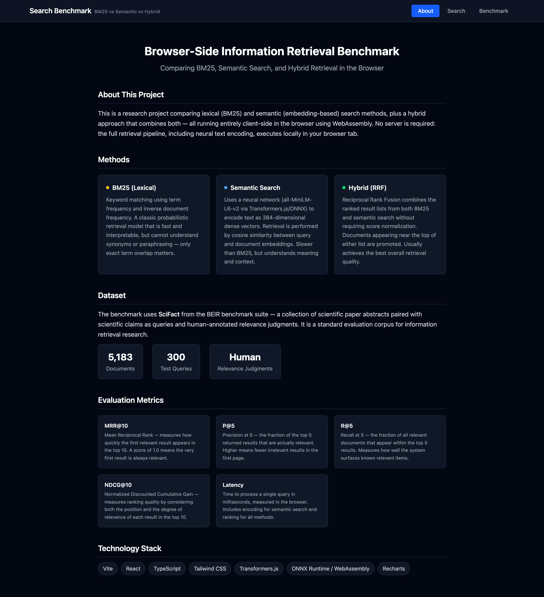
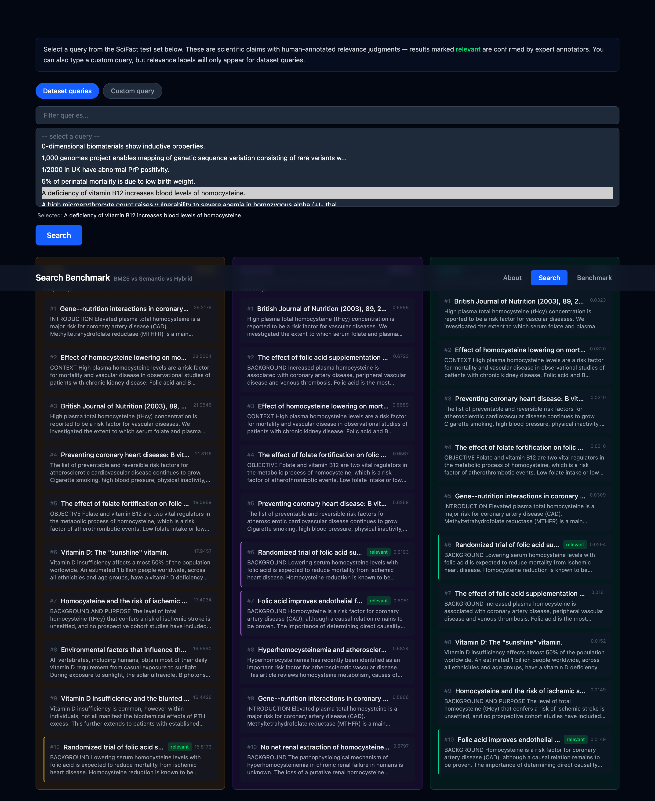
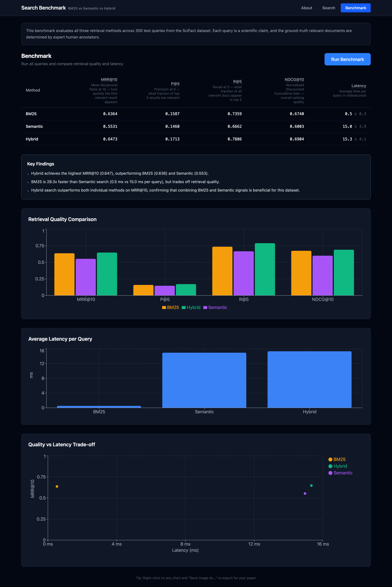

# search-benchmark

**BM25 vs Semantic vs Hybrid retrieval — entirely in the browser**

[](LICENSE)
[](https://search-benchmark-nu.vercel.app)
[](https://bmstu.ru)

## Overview

This project benchmarks three information retrieval methods — BM25, Semantic (dense vector), and Hybrid (RRF) — running entirely client-side in the browser without any backend server. The evaluation is performed on the SciFact dataset from the BEIR benchmark, measuring standard IR metrics: MRR@10, P@5, R@5, and NDCG@10.

The goal is to determine whether dense retrieval or hybrid approaches offer a meaningful quality improvement over the classical BM25 baseline, and to quantify the latency trade-off in a WebAssembly environment.

## Screenshots

| About | Search | Benchmark |
|-------|--------|-----------|
|  |  |  |

## ✨ Features

- **Three retrieval engines** implemented in TypeScript, running entirely in the browser
- **BM25** with Porter stemmer, inverted index, and tuned k1/b parameters
- **Semantic search** via `all-MiniLM-L6-v2` model through Transformers.js + ONNX Runtime WebAssembly
- **Hybrid (RRF)** fusing BM25 and semantic rankings with Reciprocal Rank Fusion
- **Interactive benchmark runner** — evaluate all three engines on 300 SciFact test queries directly in the browser
- **Results visualization** with charts (Recharts) comparing quality metrics and latency
- **Precomputed embeddings** (~7.6 MB binary) for instant semantic search without on-the-fly inference
- **No backend required** — all data, models, and evaluation logic run client-side

## Results

Benchmarked on SciFact (300 test queries, 5183 documents). Node.js environment on Apple Silicon (darwin arm64); in-browser WebAssembly latency is typically 2–5× slower.

| Method | MRR@10 | P@5 | R@5 | NDCG@10 | Latency (ms/query) |
|--------|--------|-----|-----|---------|--------------------|
| BM25 | 0.6364 | 0.1587 | 0.7359 | 0.6740 | 0.48 |
| Semantic | 0.5622 | 0.1480 | 0.6762 | 0.6065 | 3.61 |
| Hybrid | **0.6534** | **0.1713** | **0.7869** | **0.6941** | 4.04 |

**Key findings:**

- Hybrid wins on all quality metrics (MRR@10, P@5, R@5, NDCG@10)
- On SciFact, BM25 outperforms pure Semantic search — scientific queries rely on precise domain terminology where lexical matching is a strong signal
- BM25 is ~8× faster than Semantic — the core speed/quality trade-off in retrieval

### Metrics explained

| Metric | Description |
|--------|-------------|
| **MRR@10** | Mean Reciprocal Rank — how quickly the first relevant result appears (1.0 = first result is relevant) |
| **P@5** | Precision at 5 — fraction of top-5 results that are relevant |
| **R@5** | Recall at 5 — fraction of all relevant documents found in top-5 |
| **NDCG@10** | Normalized Discounted Cumulative Gain — ranking quality accounting for position and relevance grade |
| **Latency** | Per-query retrieval time in milliseconds |

## Methods

### 1. BM25

Classical probabilistic lexical retrieval. Each query term is tokenized and stemmed (Porter stemmer), matched against a prebuilt inverted index, and scored using the Okapi BM25 formula:

```
score(q, d) = Σ IDF(t) × (tf × (k1 + 1)) / (tf + k1 × (1 - b + b × dl/avgdl))
```

Parameters: `k1 = 1.2`, `b = 0.75`

Where `tf` is term frequency in document `d`, `dl` is document length, `avgdl` is average document length, and `IDF(t)` is the inverse document frequency of term `t`.

### 2. Semantic Search

Dense vector retrieval using [`all-MiniLM-L6-v2`](https://huggingface.co/sentence-transformers/all-MiniLM-L6-v2) via [`@huggingface/transformers`](https://github.com/huggingface/transformers.js) and ONNX Runtime WebAssembly.

Document embeddings (384-dimensional) are precomputed offline and stored as a compressed binary (~7.6 MB). At query time, the query is encoded with the same model and ranked by cosine similarity:

```
score(q, d) = cos(e_q, e_d) = (e_q · e_d) / (||e_q|| × ||e_d||)
```

### 3. Hybrid (RRF)

Reciprocal Rank Fusion combines the ranked lists from BM25 and Semantic search without requiring score normalization:

```
score(d) = Σ_i  1 / (k + rank_i(d))
```

Parameter: `k = 60` (standard value that prevents high-rank documents from dominating)

The final ranking is the sum of RRF scores from both constituent rankers.

## Dataset

**[SciFact](https://github.com/allenai/scifact)** from the [BEIR benchmark](https://github.com/beir-cellar/beir):

| Property | Value |
|----------|-------|
| Corpus size | 5,183 scientific paper abstracts |
| Test queries | 300 scientific claims |
| Relevance judgments | Expert-annotated qrels (ground truth) |
| Domain | Biomedical / scientific literature |

SciFact is particularly challenging for semantic search because the queries are precise scientific claims where exact terminology matters — this is why BM25 remains competitive.

## Tech Stack

| Layer | Technology |
|-------|-----------|
| Build | [Vite](https://vitejs.dev/) |
| UI | [React 19](https://react.dev/) + TypeScript |
| Styling | [Tailwind CSS 4](https://tailwindcss.com/) |
| Embeddings | [@huggingface/transformers](https://github.com/huggingface/transformers.js) (ONNX Runtime WASM) |
| Charts | [Recharts](https://recharts.org/) |
| Deployment | [Vercel](https://vercel.com/) |

## Quick Start

```bash
git clone https://github.com/vasilymsl/search-benchmark.git
cd search-benchmark
npm install
npm run dev
```

Open [http://localhost:5173](http://localhost:5173).

> The repository includes prebuilt data files (`public/`) so you can run the demo immediately without any additional setup.

## Full Setup (Rebuild Dataset)

If you want to reproduce the data pipeline from scratch:

```bash
# 1. Download and prepare the SciFact dataset
node scripts/prepare-dataset.mjs

# 2. Precompute document embeddings (requires ~5 min, downloads the ONNX model)
node scripts/precompute-embeddings.mjs

# 3. Compress embeddings to binary format (~7.6 MB)
node scripts/compress-embeddings.mjs

# 4. Run the benchmark and write results to benchmark-results.json
node scripts/run-benchmark.mjs
```

Each script is self-contained and writes its output to `public/` or the project root.

## Repository Structure

```
search-benchmark/
├── public/                        # Static assets served at runtime
│   ├── corpus.json                # 5183 SciFact abstracts
│   ├── queries.json               # 300 test queries
│   ├── qrels.json                 # Expert relevance judgments
│   └── embeddings.bin             # Precomputed 384-dim embeddings (~7.6 MB)
├── scripts/
│   ├── prepare-dataset.mjs        # Download & format SciFact
│   ├── precompute-embeddings.mjs  # Encode corpus with all-MiniLM-L6-v2
│   ├── compress-embeddings.mjs    # Float32 → binary
│   └── run-benchmark.mjs          # Evaluate all engines, write results
├── src/
│   ├── engines/                   # BM25, Semantic, Hybrid implementations
│   ├── evaluation/                # MRR, P@K, R@K, NDCG metrics
│   ├── components/                # React UI components
│   ├── data/                      # Data loading utilities
│   └── utils/                     # Stemmer, tokenizer, helpers
├── benchmark-results.json         # Latest benchmark output
├── vite.config.ts
└── package.json
```

## How to Cite

If you use this project or reference its results in academic work, please cite:

```bibtex
@misc{maslovsky2026searchbenchmark,
  author       = {Vasily Maslovsky},
  title        = {search-benchmark: BM25 vs Semantic vs Hybrid Retrieval in the Browser},
  year         = {2026},
  howpublished = {\url{https://github.com/vasilymsl/search-benchmark}},
  note         = {Supervised by A. I. Kanev. Bauman Moscow State Technical University, NIR 2026}
}
```

## Academic Context

This project is a scientific research work (NIR — научно-исследовательская работа) at **Bauman Moscow State Technical University** (МГТУ им. Н. Э. Баумана), 2026.

**Supervisor:** А. И. Канев (Anton Kanev)

The work is motivated by the growing interest in retrieval-augmented generation (RAG) systems and the question of whether modern neural retrieval methods justify their computational cost over well-tuned sparse baselines in specialized domains.

### Related Work

- Robertson, S. & Zaragoza, H. (2009). *The Probabilistic Relevance Framework: BM25 and Beyond*. Foundations and Trends in Information Retrieval.
- Karpukhin, V. et al. (2020). *Dense Passage Retrieval for Open-Domain Question Answering* (DPR). EMNLP.
- Thakur, N. et al. (2021). *BEIR: A Heterogeneous Benchmark for Zero-shot Evaluation of Information Retrieval Models*. NeurIPS Datasets and Benchmarks Track.
- Lewis, P. et al. (2020). *Retrieval-Augmented Generation for Knowledge-Intensive NLP Tasks*. NeurIPS.
- Cormack, G. V., Clarke, C. L. A., & Buettcher, S. (2009). *Reciprocal Rank Fusion outperforms Condorcet and individual Rank Learning Methods*. SIGIR.

## License

[MIT](LICENSE) © 2026 Vasily Maslovsky
