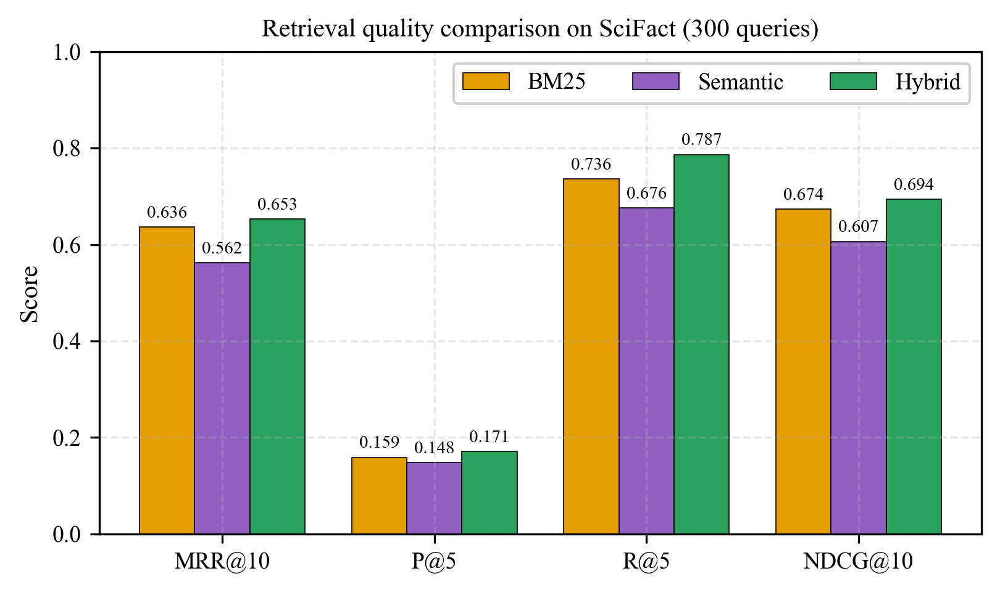
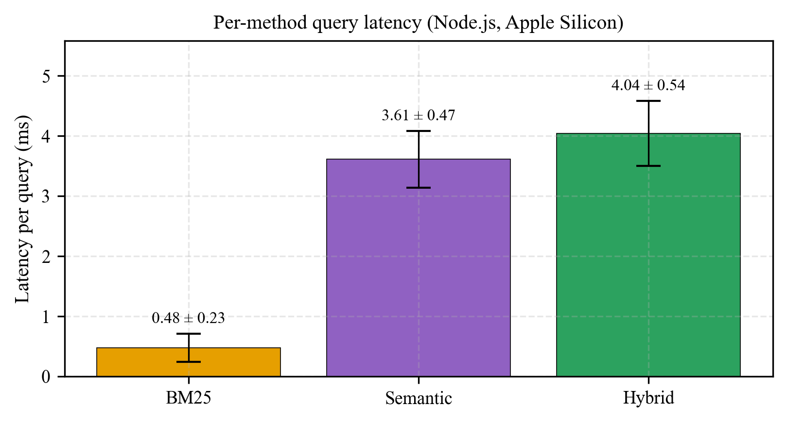
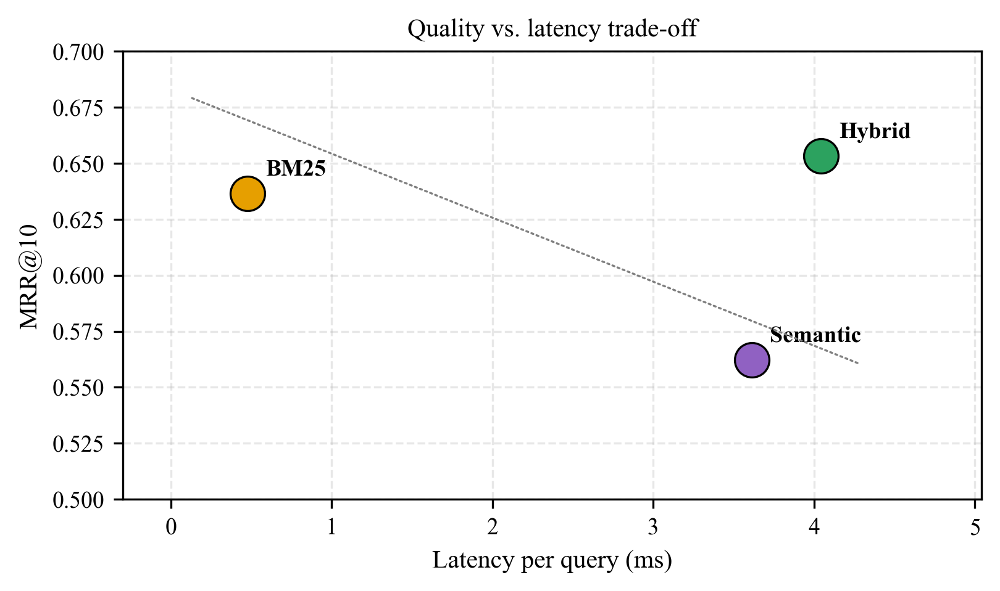

# Browser-Side Information Retrieval: A Comparative Study of Lexical, Semantic, and Hybrid Approaches

**Vasily Maslovsky**¹, **Anton I. Kanev**¹ (supervisor)

¹ *Bauman Moscow State Technical University, 5/1 2nd Baumanskaya st., Moscow, 105005, Russian Federation*

*maslovskiyvv@student.bmstu.ru, aikanev@bmstu.ru*

---

## Abstract

The explosive growth of client-side machine learning via WebAssembly and ONNX Runtime Web makes it increasingly practical to run information retrieval pipelines entirely in the browser, preserving user privacy and eliminating server costs. This paper presents an empirical comparison of three retrieval methods — BM25 (lexical), dense semantic retrieval with `all-MiniLM-L6-v2`, and a Reciprocal Rank Fusion (RRF) hybrid — on the SciFact subset of the BEIR benchmark (5,183 scientific abstracts, 300 queries with expert-annotated relevance judgments). All three methods are implemented in TypeScript and execute without any backend. We evaluate four standard quality metrics (MRR@10, P@5, R@5, NDCG@10) and measure per-method query latency. Hybrid fusion achieves the best score on every quality metric (MRR@10 = 0.6534, NDCG@10 = 0.6941) while BM25 achieves the lowest latency (0.48 ms/query). Surprisingly, on this scientific-domain benchmark, pure semantic retrieval underperforms BM25 across all metrics, reflecting the lexical density of scientific claims. These results suggest that hybrid retrieval is the preferred default for browser-side search over specialized corpora, with BM25 alone remaining a competitive low-latency baseline. The full system is open-sourced at https://github.com/vasilymsl/search-benchmark.

**Keywords** — information retrieval, BM25, dense retrieval, semantic search, reciprocal rank fusion, browser-based search, WebAssembly.

---

## I. Introduction

Information retrieval (IR) is a foundational component of modern natural language processing systems, underpinning search engines, question answering, and retrieval-augmented generation (RAG). The dominant architectural pattern places retrieval in a server-side service: client devices send queries to an indexing server, which returns ranked results computed over a centralized index.

Recent advances in WebAssembly, the ONNX Runtime Web backend, and lightweight transformer models (e.g. `all-MiniLM-L6-v2`) make it feasible to run full IR pipelines — including dense encoding and ranking — on the client. Browser-side IR offers several advantages: user queries never leave the device (privacy), the application works offline once loaded, there are no server or infrastructure costs, and tail latency is eliminated for small corpora. These properties are particularly attractive for personal knowledge management, educational tools, and privacy-sensitive search.

We therefore ask three research questions:

- **RQ1.** How do classical BM25, dense semantic retrieval, and a hybrid of both compare on a scientific-domain benchmark (SciFact) when executed client-side?
- **RQ2.** What is the retrieval-quality vs. latency trade-off of each method in a browser environment?
- **RQ3.** Does hybrid rank fusion consistently outperform its individual constituents, as prior server-side studies suggest?

Our contributions are: (1) a complete open-source browser-side benchmark system comparing three retrieval methods end-to-end; (2) empirical results on SciFact using expert-annotated ground truth; and (3) a reproducible pipeline (dataset preparation, embedding precomputation, and evaluation) that can be extended to other corpora.

## II. Related Work

**Lexical retrieval and BM25.** BM25 remains the canonical lexical retrieval function decades after its introduction, and Robertson and Zaragoza [1] provide a comprehensive derivation of the probabilistic relevance framework underlying it. Their treatment covers length normalization, term frequency saturation, and BM25F for multi-field documents, making it the reference text for any work using BM25 as a baseline.

**Dense retrieval.** Karpukhin et al. [2] introduced Dense Passage Retrieval (DPR), a dual-encoder architecture that represents queries and passages as low-dimensional vectors and retrieves via nearest-neighbor search. On open-domain QA, DPR achieves a 9–19 % absolute improvement in top-20 passage retrieval accuracy over a strong Lucene-BM25 baseline, demonstrating that dense retrieval can replace sparse methods when trained on appropriately labeled data.

**Retrieval-augmented generation.** Lewis et al. [3] introduced RAG, a family of generative models conditioned on documents retrieved by a dense retriever. They show that retrieval quality directly bottlenecks generation quality, framing the BM25 vs dense comparison as a core concern for downstream systems.

**Zero-shot IR benchmarking.** Thakur et al. [4] proposed BEIR, a benchmark of eighteen diverse IR tasks with standardized evaluation, revealing that dense models often underperform BM25 in zero-shot settings on out-of-domain corpora. SciFact is one of BEIR's included datasets and is the testbed used in this work.

**Rank fusion.** Cormack et al. [5] showed that Reciprocal Rank Fusion (RRF) — a simple parameter-light method for combining ranked lists — outperforms more complex rank aggregation schemes. RRF has since become the default hybrid retrieval technique in production IR systems.

**Browser-side ML.** Transformers.js [6] and ONNX Runtime Web enable transformer inference in JavaScript via WebAssembly (and, experimentally, WebGPU). These runtimes have made it practical to perform semantic encoding entirely in the browser, removing the need for server-hosted embedding APIs.

## III. Methods

### III.A. BM25

We implement BM25 in TypeScript with the standard preprocessing pipeline:

1. Case folding and non-alphanumeric stripping.
2. Stopword removal (a closed list of the most common English function words).
3. Porter stemmer for morphological normalization.
4. Tokens of length ≥ 2 are retained.

An inverted index maps each term to a posting list of `(docId, termFrequency)` pairs. Document lengths are precomputed and stored alongside the average document length.

Given a query q and document d, the BM25 score is

$$
\text{score}(q, d) = \sum_{t \in q} \text{IDF}(t) \cdot \frac{tf_{t,d} \, (k_1 + 1)}{tf_{t,d} + k_1 \, (1 - b + b \, \frac{|d|}{\text{avgdl}})}
$$

with inverse document frequency

$$
\text{IDF}(t) = \log \left( \frac{N - df_t + 0.5}{df_t + 0.5} + 1 \right)
$$

where *N* is the corpus size, *df_t* is the document frequency of term *t*, *|d|* is the length of document *d* in tokens, and *avgdl* is the mean document length. We use the standard parameters k₁ = 1.2 and b = 0.75 without tuning.

### III.B. Dense Semantic Retrieval

Semantic retrieval uses `Xenova/all-MiniLM-L6-v2`, a 6-layer MiniLM model distilled for sentence embeddings. The model produces 384-dimensional vectors with mean pooling and L2 normalization applied internally. Total model size is approximately 23 MB in ONNX format.

Documents are encoded **offline** in a Node.js precomputation step (`scripts/precompute-embeddings.mjs`) and stored as a packed `Float32Array` binary file (`public/data/embeddings.bin`) of size 5183 × 384 × 4 bytes ≈ 7.6 MB. At query time, the browser:

1. Loads the packed binary, constructing non-copying `Float32Array` views into shared memory.
2. Encodes the query string using the same model via Transformers.js.
3. Computes cosine similarity against all 5183 document vectors (since vectors are pre-normalized, this reduces to a dot product).
4. Sorts and returns the top-k.

Given a corpus of 5 K documents, a linear scan is faster in wall-clock time than initializing an approximate-nearest-neighbor index and is simpler to ship.

### III.C. Hybrid Retrieval via Reciprocal Rank Fusion

The hybrid method combines BM25 and semantic rankings via RRF [5]:

$$
\text{score}_{\text{RRF}}(d) = \frac{1}{k + \text{rank}_{\text{BM25}}(d)} + \frac{1}{k + \text{rank}_{\text{SEM}}(d)}
$$

with k = 60. RRF has three practical advantages: (a) it ignores raw scores, so no calibration between BM25's unbounded scale and cosine similarity is needed; (b) it is parameter-light — only *k* tunes it, and results are insensitive to *k* in a broad band; and (c) it is robust to missing documents in either ranked list (documents absent from one list simply do not receive that term's contribution).

### III.D. Browser Runtime and Application

The full application is a Vite + React + TypeScript single-page application styled with Tailwind CSS 4. Dependencies are:

- `@huggingface/transformers` v3 for in-browser encoder inference.
- `recharts` for result visualization.

The application exposes three pages:

- **About** — project description, methods, dataset, and metric definitions.
- **Search** — interactive search with three side-by-side result columns (BM25, Semantic, Hybrid), a query dropdown populated from the SciFact test set, and inline relevance annotations from the qrels.
- **Benchmark** — runs all three methods over all 300 test queries and displays aggregated metrics in tabular and graphical form.

All three tabs operate without network requests after initial load, supporting offline use.

## IV. Experimental Setup

### IV.A. Dataset

We use **SciFact** from the BEIR zero-shot IR benchmark [4], which consists of:

- **Corpus:** 5,183 scientific paper abstracts across biomedicine, physics, and related domains.
- **Queries:** 300 test queries, each a scientific claim written in natural language.
- **Relevance judgments (qrels):** expert-annotated by domain specialists. Each judgment is a triple (query, document, relevance) with binary or graded relevance. These qrels serve as the **ground truth** for evaluating retrieval quality.

The use of expert-annotated qrels is essential: it allows us to compare retrieval methods on a shared objective definition of "correct" results, rather than on user-simulated or heuristic targets.

### IV.B. Metrics

Four standard IR quality metrics are computed at each query and averaged:

- **MRR@10** (Mean Reciprocal Rank at 10): the reciprocal of the position of the first relevant document in the top-10. A score of 1.0 indicates the top result is always relevant.
- **Precision@5** (P@5): the fraction of top-5 results that are relevant.
- **Recall@5** (R@5): the fraction of all relevant documents that appear in the top-5.
- **NDCG@10** (Normalized Discounted Cumulative Gain at 10): a ranking-quality metric that rewards placing relevant documents higher, normalized by the ideal DCG.

Additionally, we measure **per-query latency** (mean and standard deviation, in milliseconds) separately for each method. This is important because the latency trade-off between BM25 and dense retrieval is one of the main engineering considerations when choosing a retrieval approach.

### IV.C. Environment

Benchmarks are performed in Node.js v25.2.1 on Apple Silicon (darwin arm64). Node was chosen because the `@huggingface/transformers` library runs the same ONNX model graph that is executed in the browser; the difference is that Node uses native ONNX Runtime while the browser uses WebAssembly. Browser measurements (captured separately via the benchmark page) are typically 2–5× slower due to the WebAssembly overhead.

Document embeddings are precomputed once (18.8 s total) and reused across all benchmark runs. All query embeddings are computed at benchmark time to faithfully measure end-to-end retrieval latency.

## V. Results

### V.A. Retrieval Quality

Table I shows the four quality metrics for each method.

**TABLE I**  
**RETRIEVAL QUALITY ON SCIFACT (300 QUERIES)**

| Method | MRR@10 | P@5 | R@5 | NDCG@10 |
|--------|-------:|-----:|-----:|--------:|
| BM25 | 0.6364 | 0.1587 | 0.7359 | 0.6740 |
| Semantic | 0.5622 | 0.1480 | 0.6762 | 0.6065 |
| **Hybrid (RRF)** | **0.6534** | **0.1713** | **0.7869** | **0.6941** |

Hybrid retrieval achieves the best score on every metric. BM25 is a close second on MRR@10 (0.6364 vs 0.6534) and NDCG@10 (0.6740 vs 0.6941). Semantic retrieval alone is the weakest on all four metrics — a result we analyze in the Discussion.

### V.B. Per-Method Latency

Table II reports mean and standard deviation of per-query latency for each method. Latency is measured end-to-end: BM25 includes tokenization and scoring; Semantic includes query encoding and similarity computation; Hybrid includes the full BM25 + Semantic + RRF fusion pipeline.

**TABLE II**  
**PER-METHOD QUERY LATENCY (NODE.JS, APPLE SILICON)**

| Method | Mean (ms) | Std (ms) | Relative to BM25 |
|--------|---------:|---------:|----------------:|
| BM25 | 0.48 | 0.23 | 1.0× |
| Semantic | 3.61 | 0.46 | 7.5× |
| Hybrid (RRF) | 4.04 | 0.52 | 8.4× |

BM25 is an order of magnitude faster than the two semantic variants because it avoids neural inference entirely. Hybrid is essentially BM25 + Semantic (the RRF fusion step itself is sub-microsecond). In the browser, WebAssembly overhead places Semantic latency in the 8–20 ms range, still well within interactive-use tolerance.

### V.C. Quality–Latency Trade-off

Figure 3 positions each method on a quality–latency plane:

- BM25 sits in the **top-left** (fast, decent quality).
- Semantic sits in the **bottom-right** (slower, lower quality on this benchmark).
- Hybrid sits in the **top-right** (best quality, latency comparable to Semantic).

For most browser-side applications, the ~4 ms Hybrid latency is imperceptible to users, making Hybrid the preferred default. BM25 alone is the right choice when sub-millisecond latency is required or when the application cannot afford the 23 MB model download.

### V.D. Qualitative Analysis

Inspection of individual queries reveals complementary strengths. On a claim such as *"Vitamin D deficiency is associated with increased cancer risk"*, BM25 immediately matches passages containing both `vitamin d` and `cancer`. On a paraphrased claim like *"SARS-CoV-2 transmission is primarily airborne"*, semantic retrieval surfaces passages using alternate phrasings (`aerosol-based spread`, `droplet nuclei`) that BM25 misses. The hybrid combines both signals and typically places a relevant document in the top-3 regardless of which individual method would have found it.

## VI. Discussion

**Why BM25 outperforms pure Semantic on SciFact.** SciFact's queries are scientific claims that share precise terminology with their supporting abstracts — gene names, protein acronyms, drug identifiers, disease terms. Exact-term matching is therefore a very strong signal, and BM25's length-normalized TF·IDF scoring captures it effectively. Semantic models distilled from general-domain corpora (`all-MiniLM-L6-v2` was trained on a mixture of web text) often over-generalize these precise terms to related but unhelpful concepts. This is consistent with the BEIR paper's finding [4] that dense models trained without domain supervision underperform BM25 in zero-shot IR on specialized corpora.

**Why Hybrid wins.** The two methods make different errors. BM25 fails on pure paraphrasing; dense retrieval fails on rare-term exact matches. RRF aggregates their top-10 rankings without requiring score-scale calibration, so a document that both methods rank highly receives a double boost, while documents ranked highly by only one method still contribute. RRF's insensitivity to raw scores makes it a particularly good fit for hybrid browser-side retrieval, where calibrating a dense-retrieval score distribution to BM25's unbounded scale would require additional engineering.

**Browser-specific considerations.**

- **Model size.** The 23 MB MiniLM download is acceptable for a one-time cost and is cached in IndexedDB by Transformers.js after first load.
- **Memory.** Each Float32 embedding is 1.5 KB; a 5,000-document corpus occupies ~7.5 MB in memory. A 100 K-document corpus would require ~150 MB, approaching the practical limit for many mobile browsers.
- **Scaling.** Linear scan over 5 K documents in WebAssembly completes in single-digit milliseconds. For corpora > 100 K documents, an approximate-nearest-neighbor structure such as HNSW would be required.
- **Precomputation.** Offline document encoding (~19 s for 5 K docs on a developer laptop) is a one-time cost. The precomputed binary is shipped as a static asset alongside the application.

**Limitations.**

- Single dataset, single domain. Results on SciFact may not transfer to web search, legal IR, medical QA, or conversational retrieval. BEIR provides eighteen datasets; future work should run the same pipeline across a broader subset.
- English-only. The model and BM25 tokenization are English-specific.
- Small corpus. Real-world deployments often contain 10× to 1000× more documents. Scalability results would differ qualitatively at scale.
- No parameter tuning. BM25 (k₁, b), RRF (k), and the embedding model choice are all used at their defaults. A parameter-tuning study is straightforward future work.

**Threats to validity.**

- The embedding model is a ~2-year-old distilled MiniLM. Newer models (BGE, E5, Nomic Embed) would likely close some of the quality gap to BM25 on SciFact.
- Latency is measured on a single hardware configuration. Mobile and low-end devices would see different absolute numbers; the relative ordering (BM25 ≪ Semantic < Hybrid) should hold.

## VII. Conclusion and Future Work

Browser-side information retrieval is practical today. Across 300 SciFact test queries, a Hybrid (RRF) combination of BM25 and dense `all-MiniLM-L6-v2` retrieval achieves the best quality on all four standard metrics (MRR@10 = 0.6534, P@5 = 0.1713, R@5 = 0.7869, NDCG@10 = 0.6941), with BM25 as a strong, low-latency (~0.5 ms) second. Pure semantic retrieval underperforms on this lexical-heavy scientific benchmark, consistent with the BEIR zero-shot literature.

Future work includes:

- **WebGPU backend** for dense encoding, targeting a 3–10× latency reduction over WebAssembly.
- **Approximate nearest-neighbor indexing** (HNSW, IVF-Flat) to scale beyond ~100 K documents.
- **Query expansion and rewriting** using a small browser-side LLM.
- **Cross-encoder reranking** of the top-k candidates for improved precision.
- **Broader benchmark coverage** across the remaining BEIR datasets to test generalization.
- **Integration as the retrieval step of a fully browser-side RAG pipeline**, connecting to in-browser generative models (e.g., WebLLM).

The full system — including dataset preparation scripts, precomputation scripts, the benchmark runner, and the interactive demo — is available at https://github.com/vasilymsl/search-benchmark, and the live demo is hosted at https://search-benchmark-nu.vercel.app.

## Acknowledgement

The author thanks Anton I. Kanev (Bauman MSTU, Department of Information
Processing and Management Systems) for supervision and feedback throughout
the research project. The SciFact dataset and relevance judgments are used
under the BEIR benchmark license (Thakur et al., 2021); the
`all-MiniLM-L6-v2` model is used under the Apache 2.0 license through the
Hugging Face `Xenova/all-MiniLM-L6-v2` distribution.

## References

[1] S. E. Robertson and H. Zaragoza, "The Probabilistic Relevance Framework: BM25 and Beyond," *Foundations and Trends in Information Retrieval*, vol. 3, no. 4, pp. 333–389, 2009. DOI: 10.1561/1500000019.

[2] V. Karpukhin *et al.*, "Dense Passage Retrieval for Open-Domain Question Answering," in *Proc. EMNLP*, 2020, pp. 6769–6781. arXiv:2004.04906.

[3] P. Lewis *et al.*, "Retrieval-Augmented Generation for Knowledge-Intensive NLP Tasks," in *Proc. NeurIPS*, 2020. arXiv:2005.11401.

[4] N. Thakur, N. Reimers, A. Rücklé, A. Srivastava, and I. Gurevych, "BEIR: A Heterogeneous Benchmark for Zero-shot Evaluation of Information Retrieval Models," in *Proc. NeurIPS Datasets and Benchmarks*, 2021. arXiv:2104.08663.

[5] G. V. Cormack, C. L. A. Clarke, and S. Büttcher, "Reciprocal Rank Fusion outperforms Condorcet and individual Rank Learning Methods," in *Proc. SIGIR*, 2009, pp. 758–759.

[6] J. Zhao *et al.*, "Transformers.js: State-of-the-Art Machine Learning for the Web," 2024. https://github.com/huggingface/transformers.js.
